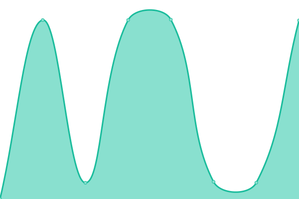

# [📈 Live Status](https://InfraestructuraGTUCP.github.io/estatus): <!--live status--> **🟧 Partial outage**

This repository contains the open-source uptime monitor and status page for [InfraestructuraGTUCP](https://InfraestructuraGTUCP.github.io/estatus), powered by [Upptime](https://github.com/upptime/upptime).

With [Upptime](https://upptime.js.org), you can get your own unlimited and free uptime monitor and status page, powered entirely by a GitHub repository. We use [Issues](https://github.com/InfraestructuraGTUCP/estatus/issues) as incident reports, [Actions](https://github.com/InfraestructuraGTUCP/estatus/actions) as uptime monitors, and [Pages](https://InfraestructuraGTUCP.github.io/estatus) for the status page.

<!--start: status pages-->
<!-- This summary is generated by Upptime (https://github.com/upptime/upptime) -->
<!-- Do not edit this manually, your changes will be overwritten -->
<!-- prettier-ignore -->
| URL | Status | History | Response Time | Uptime |
| --- | ------ | ------- | ------------- | ------ |
|  [Universidad Católica de Pereira](https://www.ucp.edu.co) | Activo | [universidad-catolica-de-pereira.yml](https://github.com/InfraestructuraGTUCP/estatus/commits/HEAD/history/universidad-catolica-de-pereira.yml) | 

 1242ms
     
 | 

<a href="https://estado.ucp.edu.co/history/universidad-catolica-de-pereira">100.00%</a>
    

|  Portal Estudiante y Docente | Activo | [portal-estudiante-y-docente.yml](https://github.com/InfraestructuraGTUCP/estatus/commits/HEAD/history/portal-estudiante-y-docente.yml) | 

 1569ms
     
 | 

<a href="https://estado.ucp.edu.co/history/portal-estudiante-y-docente">100.00%</a>
    

|  [UCP Virtual - Moodle](https://www.ucpvirtual.edu.co) | Activo | [ucp-virtual-moodle.yml](https://github.com/InfraestructuraGTUCP/estatus/commits/HEAD/history/ucp-virtual-moodle.yml) | 

 661ms
     
 | 

<a href="https://estado.ucp.edu.co/history/ucp-virtual-moodle">100.00%</a>
    

|  [Biblioteca CDCH](https://biblioteca.ucp.edu.co) | Activo | [biblioteca-cdch.yml](https://github.com/InfraestructuraGTUCP/estatus/commits/HEAD/history/biblioteca-cdch.yml) | 

 3293ms
     
 | 

<a href="https://estado.ucp.edu.co/history/biblioteca-cdch">100.00%</a>
    

|  [Repositorio](https://repositorio.ucp.edu.co) | Activo | [repositorio.yml](https://github.com/InfraestructuraGTUCP/estatus/commits/HEAD/history/repositorio.yml) | 

 630ms
     
 | 

<a href="https://estado.ucp.edu.co/history/repositorio">100.00%</a>
    

|  [Intranet](http://intranet.ucp.edu.co) | Activo | [intranet.yml](https://github.com/InfraestructuraGTUCP/estatus/commits/HEAD/history/intranet.yml) | 

 1087ms
     
 | 

<a href="https://estado.ucp.edu.co/history/intranet">100.00%</a>
    

|  Booked | Activo | [booked.yml](https://github.com/InfraestructuraGTUCP/estatus/commits/HEAD/history/booked.yml) | 

 1591ms
     
 | 

<a href="https://estado.ucp.edu.co/history/booked">100.00%</a>
    

|  Múltiples Webs | Activo | [multiples-webs.yml](https://github.com/InfraestructuraGTUCP/estatus/commits/HEAD/history/multiples-webs.yml) | 

 264ms
     
 | 

<a href="https://estado.ucp.edu.co/history/multiples-webs">100.00%</a>
    

|  [QRSF](https://qrsf.ucp.edu.co) | Caido | [qrsf.yml](https://github.com/InfraestructuraGTUCP/estatus/commits/HEAD/history/qrsf.yml) | 

 864ms
     
 | 

<a href="https://estado.ucp.edu.co/history/qrsf">98.94%</a>
    

|  Mesa de Ayuda - HelpPeople | Caido | [mesa-de-ayuda-help-people.yml](https://github.com/InfraestructuraGTUCP/estatus/commits/HEAD/history/mesa-de-ayuda-help-people.yml) | 

 1400ms
     
 | 

<a href="https://estado.ucp.edu.co/history/mesa-de-ayuda-help-people">96.99%</a>
    

|  [DNS 1](w2k12r2-dns1.ucp.edu.co) | Activo | [dns-1.yml](https://github.com/InfraestructuraGTUCP/estatus/commits/HEAD/history/dns-1.yml) | 

 289ms
     
 | 

<a href="https://estado.ucp.edu.co/history/dns-1">100.00%</a>
    

|  [DNS 2](w2k12r2-dns2.ucp.edu.co) | Activo | [dns-2.yml](https://github.com/InfraestructuraGTUCP/estatus/commits/HEAD/history/dns-2.yml) | 

 99ms
     
 | 

<a href="https://estado.ucp.edu.co/history/dns-2">100.00%</a>
    

<!--end: status pages-->

[**Visit our status website →**](https://InfraestructuraGTUCP.github.io/estatus)

## 📄 License

- Powered by: [Upptime](https://github.com/upptime/upptime)
- Code: [MIT](./LICENSE) © [InfraestructuraGTUCP](https://InfraestructuraGTUCP.github.io/estatus)
- Data in the `./history` directory: [Open Database License](https://opendatacommons.org/licenses/odbl/1-0/)
