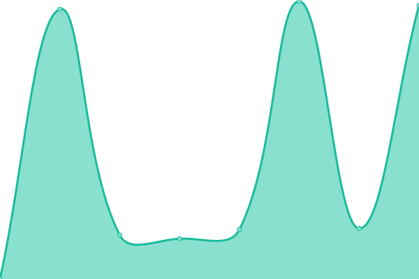

# [📈 Live Status](https://InfraestructuraGTUCP.github.io/estatus): <!--live status--> **🟧 Partial outage**

This repository contains the open-source uptime monitor and status page for [InfraestructuraGTUCP](https://InfraestructuraGTUCP.github.io/estatus), powered by [Upptime](https://github.com/upptime/upptime).

With [Upptime](https://upptime.js.org), you can get your own unlimited and free uptime monitor and status page, powered entirely by a GitHub repository. We use [Issues](https://github.com/InfraestructuraGTUCP/estatus/issues) as incident reports, [Actions](https://github.com/InfraestructuraGTUCP/estatus/actions) as uptime monitors, and [Pages](https://InfraestructuraGTUCP.github.io/estatus) for the status page.

<!--start: status pages-->
<!-- This summary is generated by Upptime (https://github.com/upptime/upptime) -->
<!-- Do not edit this manually, your changes will be overwritten -->
<!-- prettier-ignore -->
| URL | Status | History | Response Time | Uptime |
| --- | ------ | ------- | ------------- | ------ |
|  [Universidad Católica de Pereira](https://www.ucp.edu.co) | Activo | [universidad-catolica-de-pereira.yml](https://github.com/InfraestructuraGTUCP/estatus/commits/HEAD/history/universidad-catolica-de-pereira.yml) | 

 1185ms
     
 | 

<a href="https://estado.ucp.edu.co/history/universidad-catolica-de-pereira">100.00%</a>
    

|  Portal Estudiante y Docente | Activo | [portal-estudiante-y-docente.yml](https://github.com/InfraestructuraGTUCP/estatus/commits/HEAD/history/portal-estudiante-y-docente.yml) | 

 887ms
     
 | 

<a href="https://estado.ucp.edu.co/history/portal-estudiante-y-docente">100.00%</a>
    

|  [Mi aulavirtual - Moodle](https://miaulavirtual.ucp.edu.co) | Activo | [mi-aulavirtual-moodle.yml](https://github.com/InfraestructuraGTUCP/estatus/commits/HEAD/history/mi-aulavirtual-moodle.yml) | 

 1047ms
     
 | 

<a href="https://estado.ucp.edu.co/history/mi-aulavirtual-moodle">100.00%</a>
    

|  [Biblioteca CDCH](https://biblioteca.ucp.edu.co) | Activo | [biblioteca-cdch.yml](https://github.com/InfraestructuraGTUCP/estatus/commits/HEAD/history/biblioteca-cdch.yml) | 

 2313ms
     
 | 

<a href="https://estado.ucp.edu.co/history/biblioteca-cdch">100.00%</a>
    

|  [Repositorio](https://repositorio.ucp.edu.co) | Activo | [repositorio.yml](https://github.com/InfraestructuraGTUCP/estatus/commits/HEAD/history/repositorio.yml) | 

 444ms
     
 | 

<a href="https://estado.ucp.edu.co/history/repositorio">100.00%</a>
    

|  [Intranet](http://intranet.ucp.edu.co) | Caido | [intranet.yml](https://github.com/InfraestructuraGTUCP/estatus/commits/HEAD/history/intranet.yml) | 

 0ms
     
 | 

<a href="https://estado.ucp.edu.co/history/intranet">0.00%</a>
    

|  Booked | Activo | [booked.yml](https://github.com/InfraestructuraGTUCP/estatus/commits/HEAD/history/booked.yml) | 

 637ms
     
 | 

<a href="https://estado.ucp.edu.co/history/booked">100.00%</a>
    

|  Múltiples Webs | Activo | [multiples-webs.yml](https://github.com/InfraestructuraGTUCP/estatus/commits/HEAD/history/multiples-webs.yml) | 

 377ms
     
 | 

<a href="https://estado.ucp.edu.co/history/multiples-webs">100.00%</a>
    

|  [QRSF](https://qrsf.ucp.edu.co) | Activo | [qrsf.yml](https://github.com/InfraestructuraGTUCP/estatus/commits/HEAD/history/qrsf.yml) | 

 387ms
     
 | 

<a href="https://estado.ucp.edu.co/history/qrsf">100.00%</a>
    

|  [Registro usuarios](https://sru.ucp.edu.co) | Activo | [registro-usuarios.yml](https://github.com/InfraestructuraGTUCP/estatus/commits/HEAD/history/registro-usuarios.yml) | 

 389ms
     
 | 

<a href="https://estado.ucp.edu.co/history/registro-usuarios">100.00%</a>
    

|  [DNS 1](w2k12r2-dns1.ucp.edu.co) | Activo | [dns-1.yml](https://github.com/InfraestructuraGTUCP/estatus/commits/HEAD/history/dns-1.yml) | 

 86ms
     
 | 

<a href="https://estado.ucp.edu.co/history/dns-1">100.00%</a>
    

|  [DNS 2](w2k12r2-dns2.ucp.edu.co) | Activo | [dns-2.yml](https://github.com/InfraestructuraGTUCP/estatus/commits/HEAD/history/dns-2.yml) | 

 92ms
     
 | 

<a href="https://estado.ucp.edu.co/history/dns-2">100.00%</a>
    

<!--end: status pages-->

[**Visit our status website →**](https://InfraestructuraGTUCP.github.io/estatus)

## 📄 License

- Powered by: [Upptime](https://github.com/upptime/upptime)
- Code: [MIT](./LICENSE) © [InfraestructuraGTUCP](https://InfraestructuraGTUCP.github.io/estatus)
- Data in the `./history` directory: [Open Database License](https://opendatacommons.org/licenses/odbl/1-0/)
